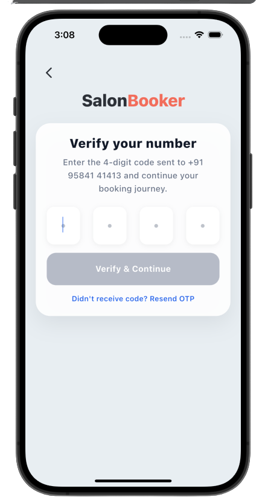
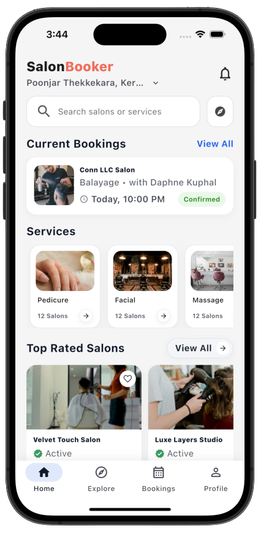
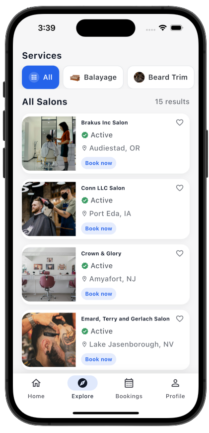
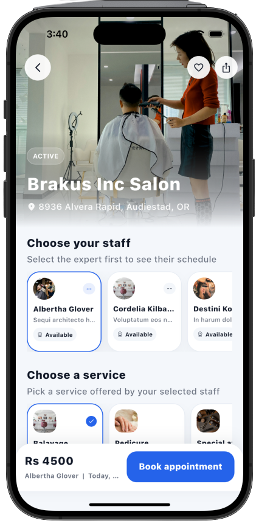
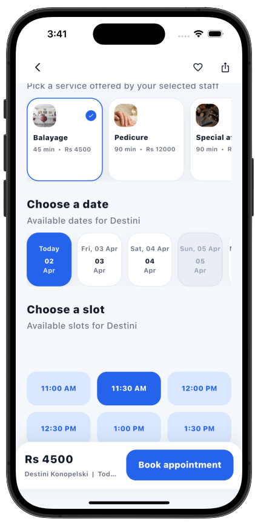
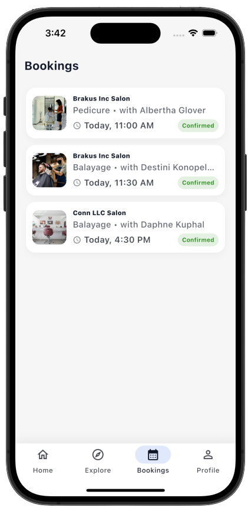
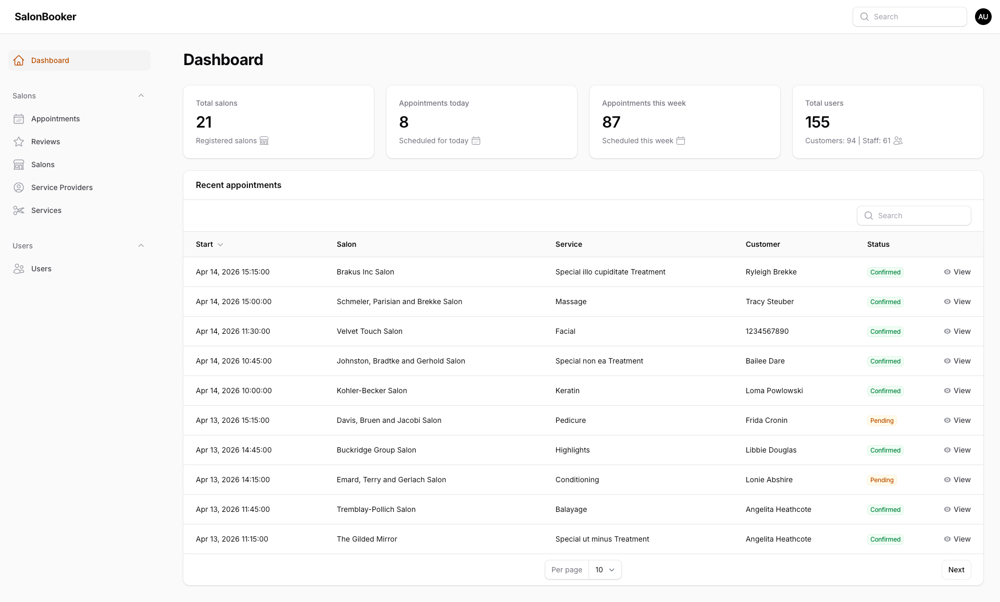
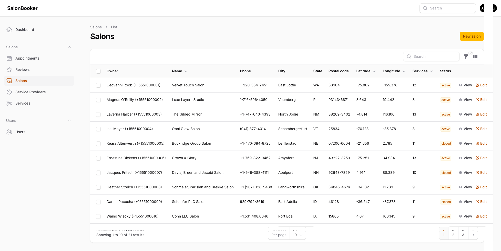
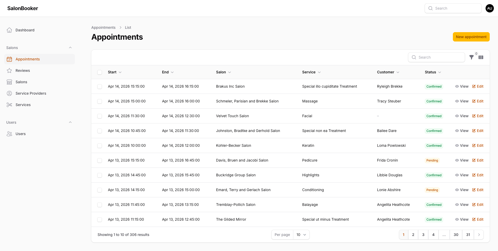

# Salon Booker

Flutter client for discovering salons, booking services, and managing appointments. It talks to a **Laravel REST API** (separate backend project) over HTTPS, with **Firebase** used for crash reporting and optional analytics-style services.

## What the app does

- **Authentication** — Phone-based sign-in with OTP verification and secure session storage.
- **Home** — Dashboard with featured salons, services, and shortcuts into explore and search.
- **Explore** — Browse salons and services, open a salon detail flow, and work through booking (staff, service, date, time).
- **Bookings** — List and review your upcoming and past appointments.
- **Profile & favorites** — Account area and saved salons (where enabled).
- **Location** — Optional location setup so nearby results and copy can stay relevant.

The **admin** screens in the gallery below are from the **backend / web admin** product that pairs with the same API (salon owners and operators manage salons, services, and appointments).

## Screenshots

### Mobile app (Flutter)

| Login | OTP |
| :---: | :---: |
|  |  |

| Home | Salon list |
| :---: | :---: |
|  |  |

| Salon detail & booking | Booking flow |
| :---: | :---: |
|  |  |

| My bookings |
| :---: |
|  |

### Admin (backend web UI)

| Dashboard | Salons | Appointments |
| :---: | :---: | :---: |
|  |  |  |

## Backend

The app expects a **JSON API** base URL configured as `API_BASE_URL` (see `.env.example`). Typical responsibilities of that backend include:

- **Auth** — OTP request/verify, tokens, and current-user endpoints consumed by Dio interceptors.
- **Content** — Home dashboard payloads (salons, services, “most booked”, banners), explore listings, search, and salon detail / booking metadata.
- **Bookings** — Creating and listing appointments tied to the authenticated user.
- **Media** — Salon and service images (often absolute URLs or paths resolved against the API host).
- **Admin** — Web UI (screenshots above) for operators to manage salons, catalog, and appointment queues on the same data model.

The Flutter app does **not** embed Laravel; you run the API separately (e.g. `php artisan serve` or your production host) and point `API_BASE_URL` at it.

## Tech stack (Flutter)

| Area | Choice |
|------|--------|
| UI | Flutter 3.x, `ScreenUtil`, Material |
| State | `flutter_bloc` + Cubits where used |
| Navigation | `go_router` |
| HTTP | `dio` + secure storage for session |
| Config | `flutter_dotenv` (`.env` — not committed; use `.env.example`) |
| Crash reporting | Firebase Crashlytics (release) |
| Payments | Razorpay (checkout flows where integrated) |

## Getting started

1. **Install Flutter** (SDK in `pubspec.yaml` constraint).
2. **Dependencies**

   ```bash
   flutter pub get
   ```

3. **Environment** — Copy `.env.example` to `.env` and set at least:

   - `API_BASE_URL` — your Laravel API root (e.g. `https://your-host.example/api`).

4. **Firebase** — Add platform apps in Firebase Console, then either:

   - run `flutterfire configure`, or  
   - place `google-services.json`, `GoogleService-Info.plist`, and `lib/firebase_options.dart` per your project rules (see `.gitignore` if those files are excluded from the public repo).

5. **Run**

   ```bash
   flutter run
   ```

## Project layout (high level)

- `lib/core` — routing, theme, network (Dio), DI (`get_it`), auth/location notifiers.
- `lib/features` — feature modules (`authentication`, `home`, `explore`, `bookings`, `profile`, `location`, `checkout`, `search`, etc.).
- `screen_shots` — marketing / README imagery (not bundled into the app build).

## License

Specify your license here when you publish the repo.
